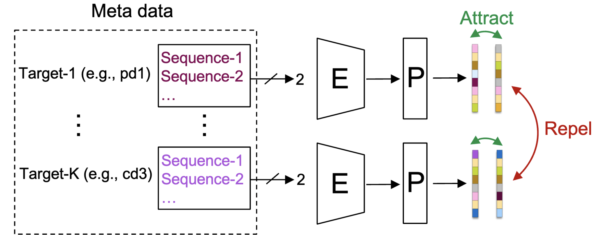
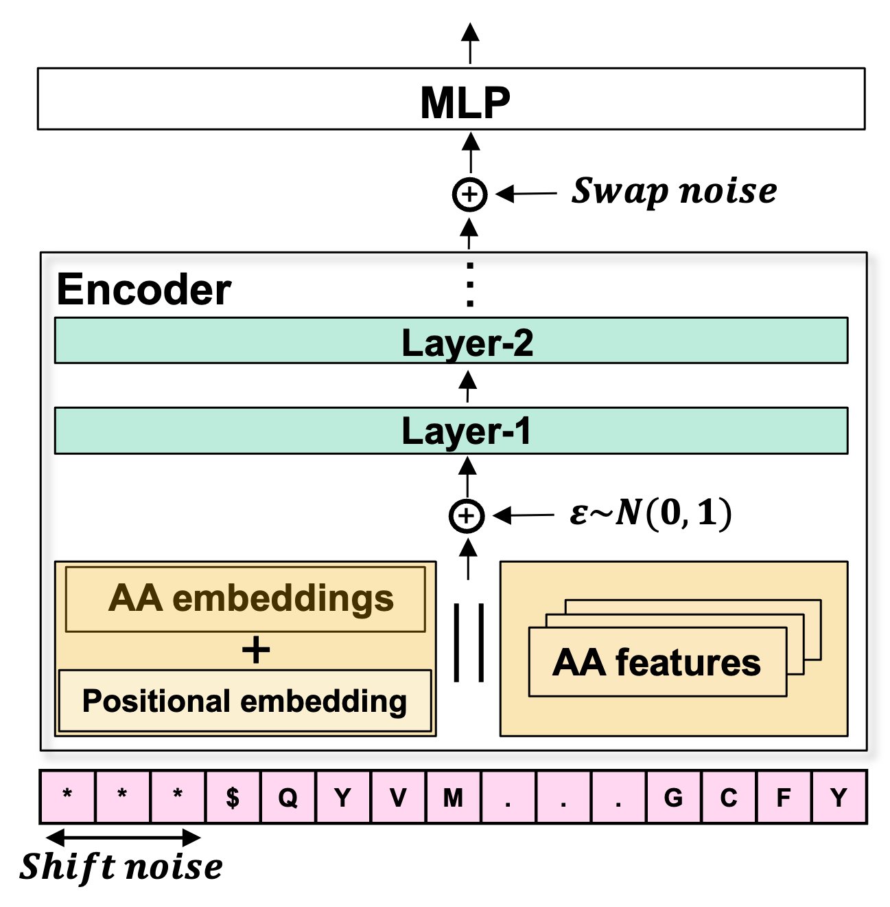

# SelfPAD: 
##### Author: Talip Ucar (ucabtuc@gmail.com)

The official implementation of "Improving Antibody Humanness Prediction using Patent Data". 


[Improving Antibody Humanness Prediction using Patent Data](TBD: url to arxiv)


# Table of Contents:

1. [Model](#model)
2. [Environment](#environment)
3. [Configuration](#configuration)
4. [Training and Evaluation](#training-and-evaluation)
5. [Structure of the repo](#structure-of-the-repo)
6. [Results](#results)
7. [Experiment tracking](#experiment-tracking)
8. [Citing the paper](#citing-the-paper)
9. [Citing this repo](#citing-this-repo)


# Model

Pre-training             |  Fine-tuning
:-------------------------:|:-------------------------:
  |  


# Environment
We used Python 3.7 for our experiments. The environment can be set up by following three steps:

```
pip install pipenv             # To install pipenv if you don't have it already
pipenv install --skip-lock     # To install required packages. 
pipenv shell                   # To activate virtual env
```

If the second step results in issues, you can install packages in Pipfile individually by using pip i.e. "pip install package_name". 


# Configuration
There are two types of configuration files:
```
1. pad.yaml         # Defines parameters and options for pre-training
2. humanness.yaml   # Defines parameters and options for fine-training
```


# Training and Evaluation
You can train and evaluate the model by using:

```
python selfpad_pretrain.py        # For pre-training
python selfpad_finetune.py        # For fine-tuning it for humanness
python selfpad_eval.py -ev test    # To compute humanness score for custome dataset, in this case it is test.csv. CSV file should have "VH", "VL" and/or "Label" columns
```


# Structure of the repo
<pre>
- selfpad_pretrain.py
- selfpad_finetune.py
- selfpad_eval.py

- src
    |-selfpad.py
    |-selfpad_humanness.py

- config
    |-pad.yaml
    |-humanness.yaml
    
- utils_common
    |-arguments.py
    |-utils.py
    |-tokenizer.py
    ...
    
- utils_pretrain
    |-load_data.py
    |-model_utils.py
    |-loss_functions.py
    ...
    
- utils_finetune
    |-load_data.py
    |-model_utils.py
    |-loss_functions.py
    ...
    
- data
    |-test.csv
    ...
    
- results
    |-pretraining
    |-humanness
    ...
    
</pre>

# Results

Results at the end of training is saved under ```./results``` directory. Results directory structure is as following:

<pre>
- results
    |-task e.g. humanness, or pretraining
            |-evaluation
                |-clusters (for plotting t-SNE and PCA plots of embeddings)
            |-training
                |-model
                |-plots
                |-loss
</pre>

You can save results of evaluations under "evaluation" folder. 


# Experiment tracking
You can turn on Weight and Biases (W&B) in the config file for logging 

# Citing the paper

```
@article{ucar2024SelfPAD,
  title={Improving Antibody Humanness Prediction using Patent Data},
  author={Ucar, Talip and 
          Ramon, Aubin and 
          Oglic, Dino and 
          Croasdale-Wood, Rebecca and 
          Diethe, Tom and 
          Sormanni, Pietro},
  journal={arXiv preprint arXiv:2110.04361},
  year={2024}
}
```

# Citing this repo
If you use SelfPAD framework in your own studies, and work, please cite it by using the following:

```
@Misc{talip_ucar_2024_SelfPAD,
  author =   {Talip Ucar},
  title =    {{Improving Antibody Humanness Prediction using Patent Data}},
  howpublished = {\url{https://github.com/AstraZeneca/SelfPAD}},
  month        = January,
  year = {since 2024}
}
```
